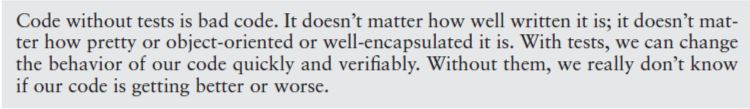

# Working Effectively with Legacy Code
The book is about how can we address or handle Legacy Code. There are several techniques given in the book which answers common questions being asked by every developer who handles legacy code. The book will teach you how to refactor, read and understand, and test a Legacy Code. To have better understanding, let's define first what is Legacy Code. 

### What is Legacy Code?

It is the worst nightmare of every developer. Why? Because it is a code base with automated testing. That's it! It is quoted in the book:

## Part I: The Mechanics of Change

For this part, the main focus...
