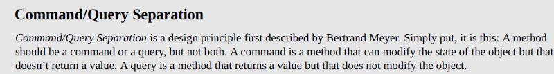
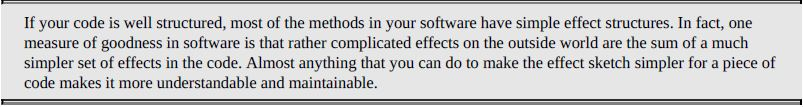
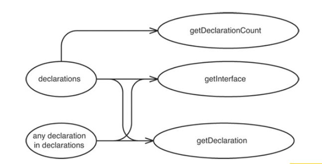
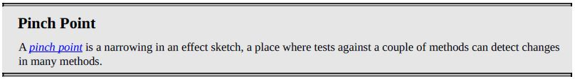
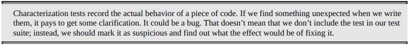

# Working Effectively with Legacy Code
The book is about how can we address or handle Legacy Code. There are several techniques given in the book which answers common questions being asked by every developer who handles legacy code. The book will teach you how to refactor, read and understand, and test a Legacy Code. To have better understanding, let's define first what is Legacy Code. 

### What is Legacy Code?

It is the worst nightmare of every developer. Why? Because it is a code base without automated testing, it is also called <i>"Spaghetti Code"</i>, and messy code structure. That's it! It is quoted in the book:

## Part I: The Mechanics of Change

### Changing Software

There are <b>Four Reasons to Change Software</b> stated in the book, which are:
<ul>
    <li>Adding a Feature</li>
    <li>Fixing a bug</li>
    <li>Improving the design</li>
    <li>Optimizing resource usage</li>
</ul>

Knowing the difference of <b>Adding a Feature and Fixing a bug</b> is somehow unclear. While working for a specific change, developer may say that it is an additional feature while customer may say that it is only a bug fix. In the book <i>Behavior</i> was used to clearly define those two. The difference of adding new behavior and changing old behavior is quoted in the book:

<b>Improving the design</b> is simply refactoring, this is the change of software wherein we want to improve the structure of the code and make it more readable and main table. <i>Refactoring</i> means that changes that we apply does not change the behavior of the system.

<b>Optimization</b>, almost same with Refactoring by not changing system's behavior but the purpose is different. In Optimization the purpose is to make the code faster, it focuses on saving memory.

We realized that the hardest part of changing a software is maintain its behavior or <i>Preserving behavior</i>. Why? Because there are changes that can be risky, we must ensure that we know why we are making that specific change, analyze the change, be cautious, and <i>“If it’s not broke, don’t fix it.”</i> 

### Working with Feedback

### Sensing and Separation

### The Seam Model

### Tools

## Part II: Changing Software

### I Don't Have Much Time and I Have to Change It

When the new feature is urgent and should be implemented within the day, developer may feel pressure. It will be hard for the developer to know and evaluate if it is possible to add a unit test for the feature. Problem is, if the base code is a Legacy Code it will be hard to estimate the effort that will be needing to implement a unit test. 

There are four techniques given in the book to handle this case:
<ul>
    <li>Sprout Method</li>
    <li>Sprout Class</li>
    <li>Wrap Method</li>
    <li>Wrap Class</li>
</ul>

<b>Sprout Method</b> 
Means that we should write code in a new method then the new method should be developed using TDD.
With this technique, it would be much easier to test and easier to understand the new code because it is already separated from the old code. There are also downsides of using this technique but at least it is applicable if the new feature is urgent.

<b>Sprout Class</b>
Means that we will create a new class for the new feature and then will use this class in the existing code.

<b>Wrap Method</b>
There are different kinds of implementing Wrap Method. One is creating a new method using the old code's method name, this is to add a behavior in the existing method. Second is renaming of an existing method.

<b>Wrap Class</b>
Wrap Method and Wrap Class are somehow similar, almost have the same concept. This is also known as <i>Decorator Pattern</i> technique wherein we create objects of a class that wraps another class and pass around.

### It Takes Forever to Make a Change

Measuring how long does it takes when making changes is not easy. It is depending on how large the change will be, how clear is the base code, how messy is the base code, etc. In the book, this chapter only discussed what are the reasons and solutions why <b>It Takes Forever to Make a Change</b>.

<b>Understanding</b>
It takes too much time knowing what to change in the code. One of the reason is unfamiliarity, when developers are not familiar with the codes it will take time to understand it. Another thing is that there is Well-Maintained System and a Legacy System. Sure, it is easier to add change in a Well-Maintained System rather than a Legacy System. The smaller, cleaner, understandable the code is, the easier to change.

<b>Lag Time</b>
In the book, Lag Time is defined as "The amount of time that passes between a change that you make and the
moment that you get real feedback about the change." We usually try to add all changes and make them work to avoid building often. Cases is that if change worked then we can proceed. But, if it fails changing becomes slower and slower. Issue is dependency, when we want to compile a specific change we also need to compile other things because of dependency. 

<b>Breaking Dependencies</b>
So how do we break dependencies? //

### How Do I Add a Feature
TDD was defined as the most powerful technique when adding a feature. We should keep in mind that creating TDD is one step at a time or baby steps. Steps when creating a TDD are:
<ul>
    <li>Write a Failing Test (red)</li>
    <li>Make it Pass (green)</li>
    <li>Refactor (Remove duplication) </li>
    <li>Repeat</li>
</ul>
Another technique that was discussed is Programming by Difference wherein we create subclass that can override the super class. Applying Inheritance is a good technique because we can add the new feature without changing the super class. We can add changes immediately and apply as well clean code. 

### I Can't Get This Class into a Test Harness

This chapter discussed several problems adding class in Test Harness and several solutions to handle those. 
There are some points that I want to take note in this Chapter: First, is that when we need to add a class into a Test Harness we should try it first before evaluating how hard to add a test on it. Second, we should keep in mind that test code should always be clean although Test Code and Production Code does not have the same standard we should still check the cleanliness of a code. Third, when handling constructors and then the object requires a hard parameter to construct we can just pass null parameters. But we should make sure that we do this only in test code, we should avoid passing null parameter on production not unless it is required, or we have no other choice. Fourth, Parameterized Constructor</i>... Fifth, <i>Singleton Design Patter</i>... Sixth, <i>Subclass and Override Method</i> //

### I Can't Run This Method in a Test Harness

This chapter discussed several problems adding method in Test Harness and several solutions to handle those. Writing tests for methods that we will be changing is the second part of the battle after instantiating the class. There are some points that I want to take note in this Chapter: First, when we are having trouble writing test for private methods we can try writing test through a public method. There are several reasons stated in the book on why we not want to change private methods to public just to test it:
<ul>
    <li>The method is just a utility; it isn’t something clients would care about. </li>
    <li>If clients use the method, they could adversely affect results from other methods on the class. </li>
</ul>
There's a solution for the second problem, it is to move the private methods into a new class and change it to public then class can create an internal instance of it.
Second, the reason as to why it is hard to test the image of the class is because of its too many responsibilities. Solution is to break down the class into smaller pieces, but it will take time refactoring and consider how much time we still have. Third, there are methods that we can't just easily test because of it does not return values such as GUI. We cannot write tests for methods that generates window, solution is to use the tool which is <i>Extract Method</i> to divide the method. Fourth is the difference between command method and query:

Last note that we should keep in mind from the book: Is that it is okay to make the code cleaner afterwards, it is okay to extract methods with poor name and poor structure. We should focus on writing the tests in place.

### I Need to Make a Change. What Methods Should I Test?

This chapter discussed on where we should we write tests when we make changed. The simplest answer is that write tests for all the methods that we are going to change. But this is not easy, we should know the effects and we need to reason about the effects when writing tests. The book suggested using <i>Effect Sketching</i>, wherein we will create diagram to visualize the effects of changing fields, methods, etc. There are many advantages when we use Effect Sketching.

Sample diagram of Effect Sketching:

It was also suggested to apply <i>Characterization Tests</i> around Legacy Code. Reason why we should do this is to know the current behavior of the system and to evaluate effects of change. Also, to know the impact to downstream if objects stop working. 

Encapsulation and Test Coverage was also discussed in this chapter, it is quoted in the book that "Breaking encapsulation can make
reasoning about our code harder, but it can make it easier if we end up with good explanatory tests afterward". When we do test coverage first it can help get more encapsulation afterwards. 

When we are writing tests, it is important to know first the effect and the affected once changes were applied. 

### I Need to Make Many Changes in One Area. Do I Have to Break Dependencies for All the Classes Involved?

Adding tests to a well written code is easier than writing tests in a Legacy Code. There's no need to break dependencies but the best thing to do is to find a point where to write test which will handle several cases. The book introduced <i>Interception Point</i> which is a point that can detect the effect of the changes we make. There are two benefits discussed in the book when using Interception Point: "We could have less dependency breaking to do, and we’re also holding a bigger chunk in the vise". Another thing that was mentioned in the book is <i>Pinch Points</i>. It is quoted in the book:

The main suggestion for this chapter is that when we are writing tests we should make the tests close to the change point as much as possible.

### I Need to Make a Change, but I Don't Know What Tests to Write

The book introduced <b>Characterization Tests</b> for us to know the current behavior of the system. When we are changing the current system, it is important to understand the flow of the system or what it does. There are several steps written in the book when writing Characterization Tests:
<ul>
    <li>Use a piece of code in a test harness. </li>
    <li>Write an assertion that you know will fail. </li>
    <li>Let the failure tell you what the behavior is. </li>
    <li>Change the test so that it expects the behavior that the code produces. </li>
</ul>
Characterization Tests was defined in the book as:

Another thing that was discussed in this chapter is what to do whenever we find bugs. We should only fix the bug if the system is not yet deployed otherwise just raise the bug you encountered.

## Part III: Dependency-Breaking Techniques
