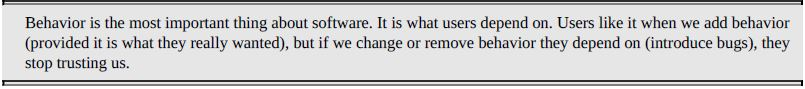
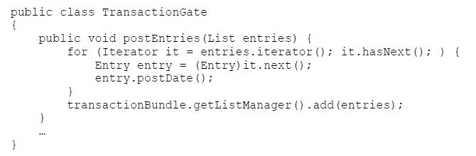
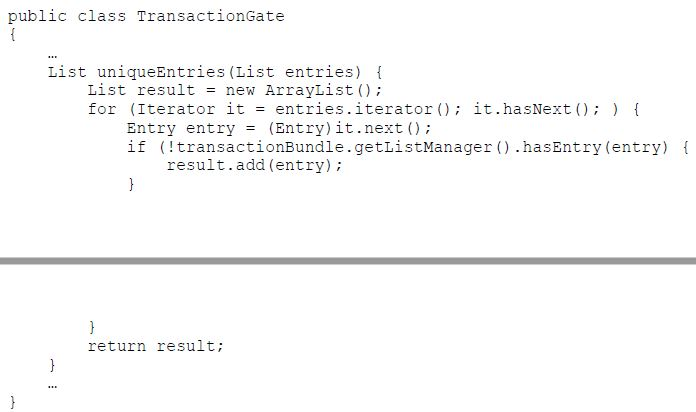
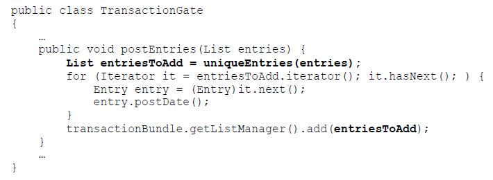

# Working Effectively with Legacy Code
The book is about how can we address or handle Legacy Code. There are several techniques given in the book which answers common questions being asked by every developer who handles legacy code. The book will teach you how to refactor, read and understand, and test a Legacy Code. To have better understanding, let's define first what is Legacy Code. 

### What is Legacy Code?

It is the worst nightmare of every developer. Why? Because it is a code base without automated testing, it is also called <i>"Spaghetti Code"</i>, and messy code structure. That's it! It is quoted in the book:

## Part I: The Mechanics of Change

### Changing Software

There are <b>Four Reasons to Change Software</b> stated in the book, which are:
<ul>
    <li>Adding a Feature</li>
    <li>Fixing a bug</li>
    <li>Improving the design</li>
    <li>Optimizing resource usage</li>
</ul>

Knowing the difference of<b>Adding a Feature and Fixing a bug</b> is somehow unclear. While working for a specific change, developer may say that it is an additional feature while customer may say that it is only a bug fix. In the book <i>Behavior</i> was used to clearely define those two. The difference of adding new behavior and changing old behavior is quoted in the book:

<b>Improving the design</b> is simply refactoring, this is the change of software wherein we want to improve the structure of the code and make it more readable and maintable. <i>Refactoring</i> means that changes that we apply does not change the behavior of the system.

<b>Optimization</b>, almost same with Refactoring by not changing system's behavior but the purpose is different. In Optimization the purpose is to make the code faster, it focuses on saving memory.

We realized that the hardest part of changing a software is maintaing its behavior or <i>Preserving behavior</i>. Why? Because there are changes that can be risky, we must ensure that we know why we are making that specific change, analyze the change, be cautious, and <i>“If it’s not broke, don’t fix it.”</i> 

### Working with Feedback

### Sensing and Separation

### The Seam Model

### Tools

## Part II: Changing Software

### I Don't Have Much Time and I Have to Change It

When the new feature is urgent and should be implemented within the day, developer may feel pressure. It will be hard for the developer to know and evaluate if it is possible to add a unit test for the feature. Problem is, if the base code is a Legacy Code it will be hard to estimate the effort that will be needing to implement a unit test. 

There are four techniques given in the book to handle this case:
<ul>
    <li>Sprout Method</li>
    <li>Sprout Class</li>
    <li>Wrap Method</li>
    <li>Wrap Class</li>
</ul>

<b>Sprout Method</b> 
Means that we should write code in a new method then the new method should be developed using TDD. An example in the book is that in the <i>TransactionGate</i> method we need to check if entry is not yet in the <i>transactionBundle</i>.

To apply Sprout Method, instead of editing <i>TransactionGate</i> and just add a checking we need to create a new method for that.

With this technique, it would be much more easier to test and easier to understand the new code because it is already separated from the old code. There are also downsides of using this technique but at least it is applicable if the new feature is urgent.

<b>Sprout Class</b>
Means that we will create a new class for the new feature and then will use this class in the existing code.

<b>Wrap Method</b>
There are different kinds of implementing Wrap Method. One is creating a new method using the old code's method name, this is to add a behavior in the existing method. Second is renaming of an existing method.

<b>Wrap Class</b>
Wrap Method and Wrap Class are somehow similar, almost have the same concept. This is also known as <i>Decorator Pattern</i> technique wherein we create objects of a class that wraps another class and pass around.

### It Takes Forever to Make a Change

Measuring how long does it takes when making changes is not easy. It is depending on how large the change will be, how clear is the base code, how messy is the base code, etc. In the book, this chapter only discussed what are the reasons and solutions why <b>It Takes Forever to Make a Change</b>.

<b>Understanding</b>
It takes too much time knowing what to change in the code. One of the reason is unfamiliarity, when developers are not familiar with the codesb it will take time to understand it. Another thing is that there is Well-Maintained System and a Legacy System. Sure enough that it is easier to add change in a Well-Maintained System rather than a Legacy System. The smaller, cleaner, understandble the code is, the easier to change.

<b>Lag Time</b>
In the book, Lag Time is defined as "The amount of time that passes between a change that you make and the
moment that you get real feedback about the change." We usually try to add all changes and make them work to avoid building oftem. Cases is that if change worked then we can proceed. But, if it fail changing becomes slower and slower. Issue is dependency, when we want to compile a specific change we also need to compile other things because of dependency. 

<b>Breaking Dependencies</b>
So how do we break dependencies? //

### How Do I Add a Feature
TDD was defined as the most powerful technique when adding a feature. We should keep in mind that creating TDD is one step at atime or baby steps. Steps when creating a TDD are:
<ul>
    <li>Write a Failing Test (red)</li>
    <li>Make it Pass (green)</li>
    <li>Refactor (Remove duplication)</li>
    <li>Repeat</li>
</ul>
Another technique that was discussed is Programming by Difference wherein we create subclass that can override the super class. Applying Inheritance is a good technique because we can add the new feature without changing the super class. We can add changes immediately and apply as well clean code. 

### I Can't Get This Class Into a Test Harness

### I Can't Run This Method in a Test Harness

### I Need to Make a Change. What Methods Should I Test?

### I Need to Make Many Changes in One Area

### I Need to Make a Change, but I Don't Know What Tests to Write

## Part III: Dependency-Breaking Techniques
